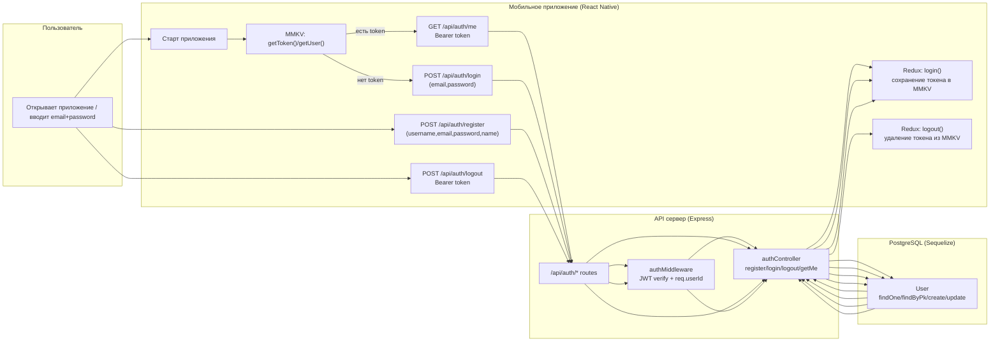
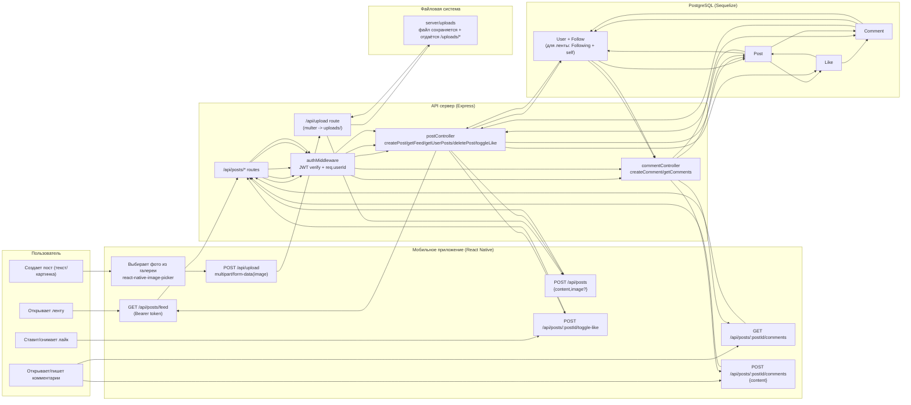
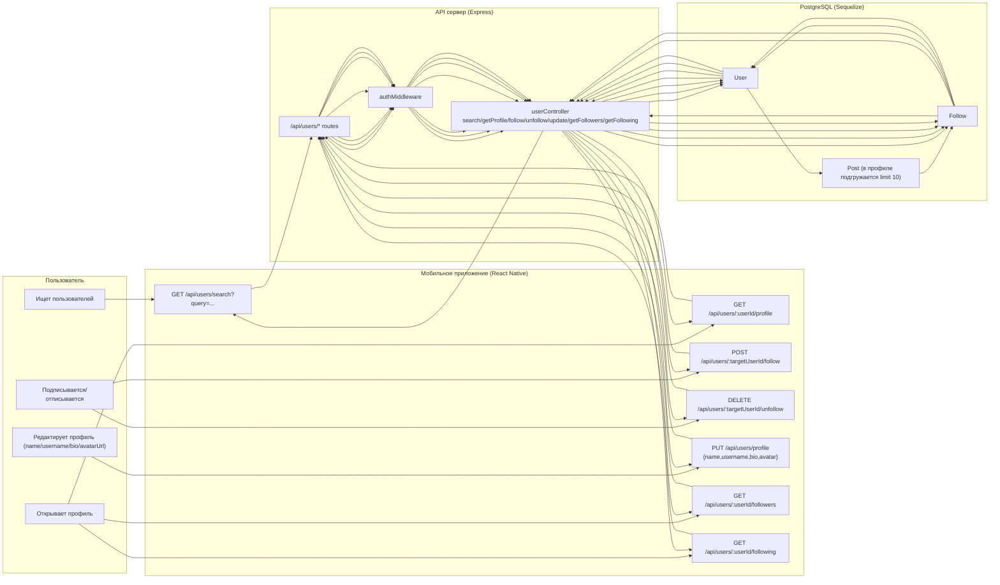
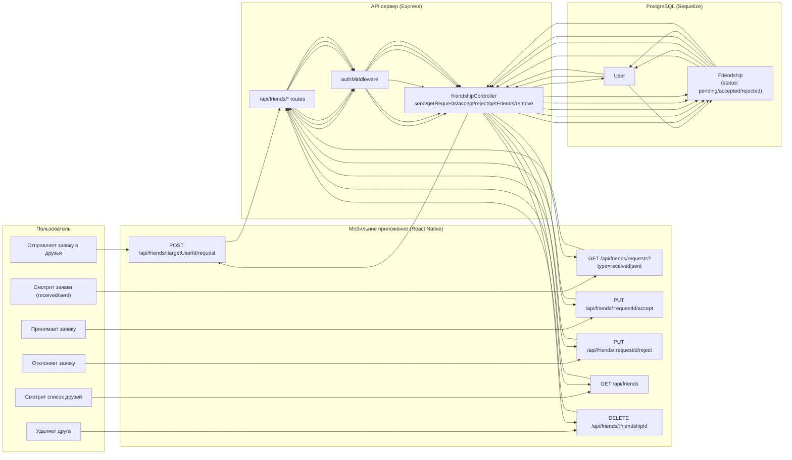
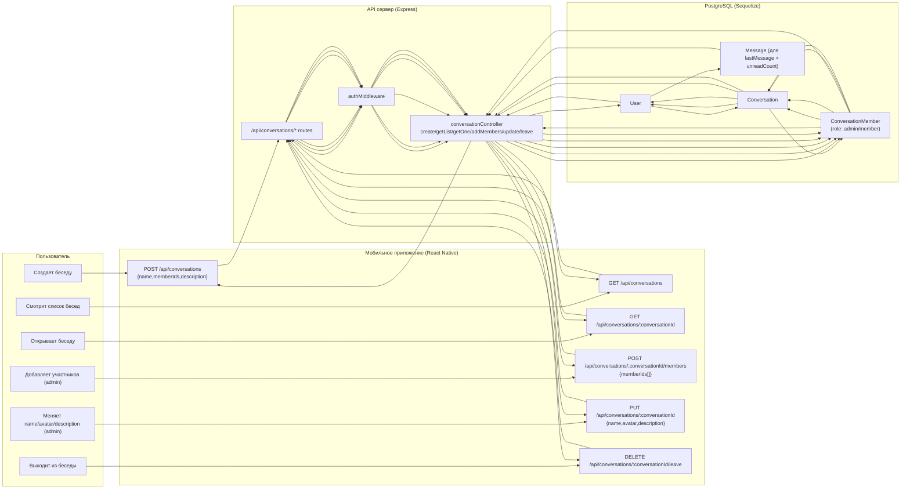
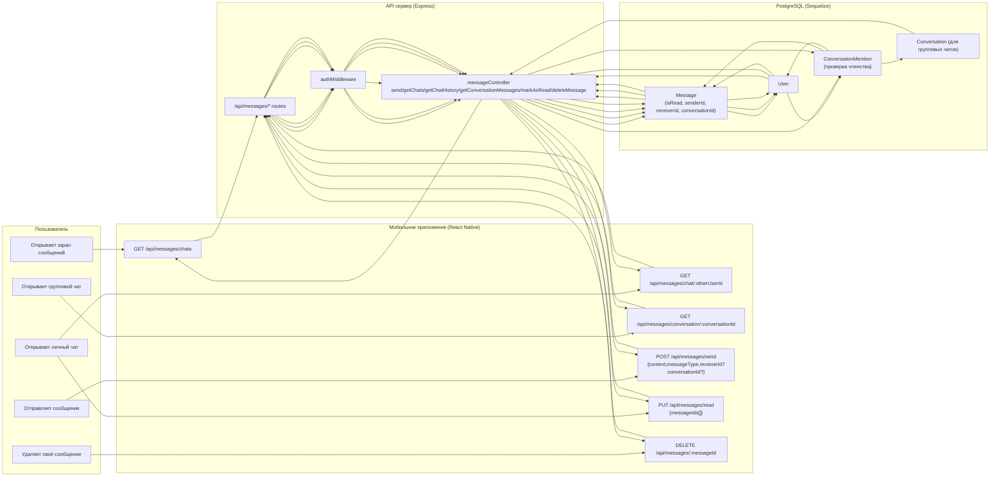

# Swimlane диаграммы (полное покрытие проекта)

Формат: Mermaid (flowchart + swimlane через `subgraph`).

## 1) Авторизация + восстановление сессии

## 2) Лента, посты, загрузка картинки, лайки, комментарии

## 3) Пользователи: поиск, профиль, follow/unfollow, редактирование профиля

## 4) Друзья: заявки, принятие/отклонение, список, удаление

## 5) Беседы (групповые): создание, список, информация, добавление участников, редактирование, выход

## 6) Сообщения (REST): список чатов, история ЛС, сообщения в беседу, прочтение, удаление

## Полный список внешних точек (для самопроверки)

REST:
- `POST /api/auth/register`
- `POST /api/auth/login`
- `POST /api/auth/logout`
- `GET /api/auth/me`
- `GET /api/users/search`
- `GET /api/users/:userId/profile`
- `POST /api/users/:targetUserId/follow`
- `DELETE /api/users/:targetUserId/unfollow`
- `PUT /api/users/profile`
- `GET /api/users/:userId/followers`
- `GET /api/users/:userId/following`
- `POST /api/posts`
- `GET /api/posts/feed`
- `GET /api/posts/user/:userId`
- `DELETE /api/posts/:postId`
- `POST /api/posts/:postId/toggle-like`
- `POST /api/posts/:postId/comments`
- `GET /api/posts/:postId/comments`
- `POST /api/upload` (multipart image)
- `GET /api/messages/chats`
- `GET /api/messages/chat/:otherUserId`
- `GET /api/messages/conversation/:conversationId`
- `POST /api/messages/send`
- `PUT /api/messages/read`
- `DELETE /api/messages/:messageId`
- `GET /api/conversations/test`
- `POST /api/conversations`
- `GET /api/conversations`
- `GET /api/conversations/:conversationId`
- `POST /api/conversations/:conversationId/members`
- `PUT /api/conversations/:conversationId`
- `DELETE /api/conversations/:conversationId/leave`
- `GET /api/friends`
- `GET /api/friends/requests`
- `POST /api/friends/:targetUserId/request`
- `PUT /api/friends/:requestId/accept`
- `PUT /api/friends/:requestId/reject`
- `DELETE /api/friends/:friendshipId`
